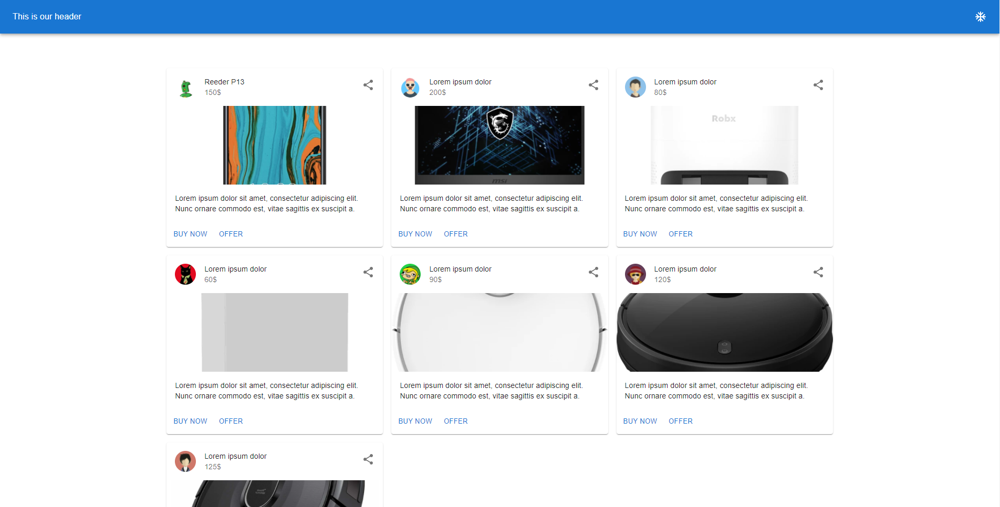

# Material-UI-React-Tutorial
Material UI React Tutorial

## Road Map

- [Lesson-1](#lesson-1)
    - UX Design Example
- [Lesson-2](#lesson-2)
    - Make Style
    - Conditional style
    - Buttons
    - Typographys 
    - Theme Change
- [Lesson-3](#lesson-3)
    - Grid & Grid Layout

## Lesson-1 UX Design Example  

[to go to the lesson](ux-design)

## Lesson-2  

[to go to the lesson](make-styles)

## Lesson-3  

[to go to the lesson](grids)

